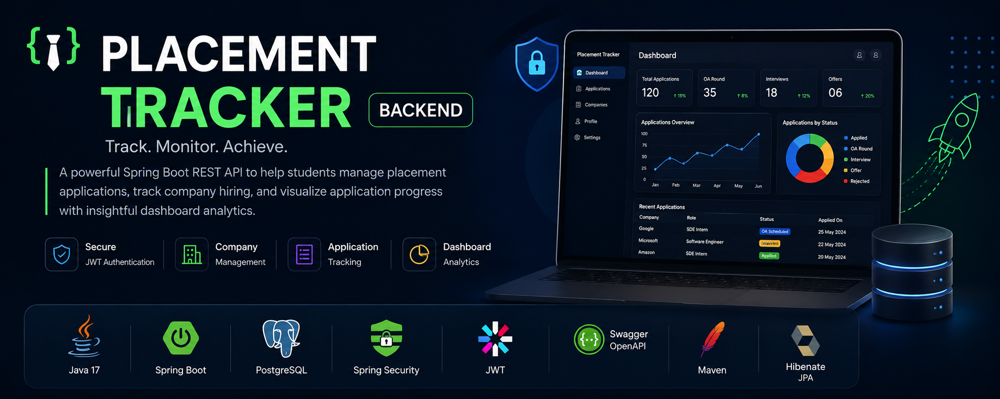
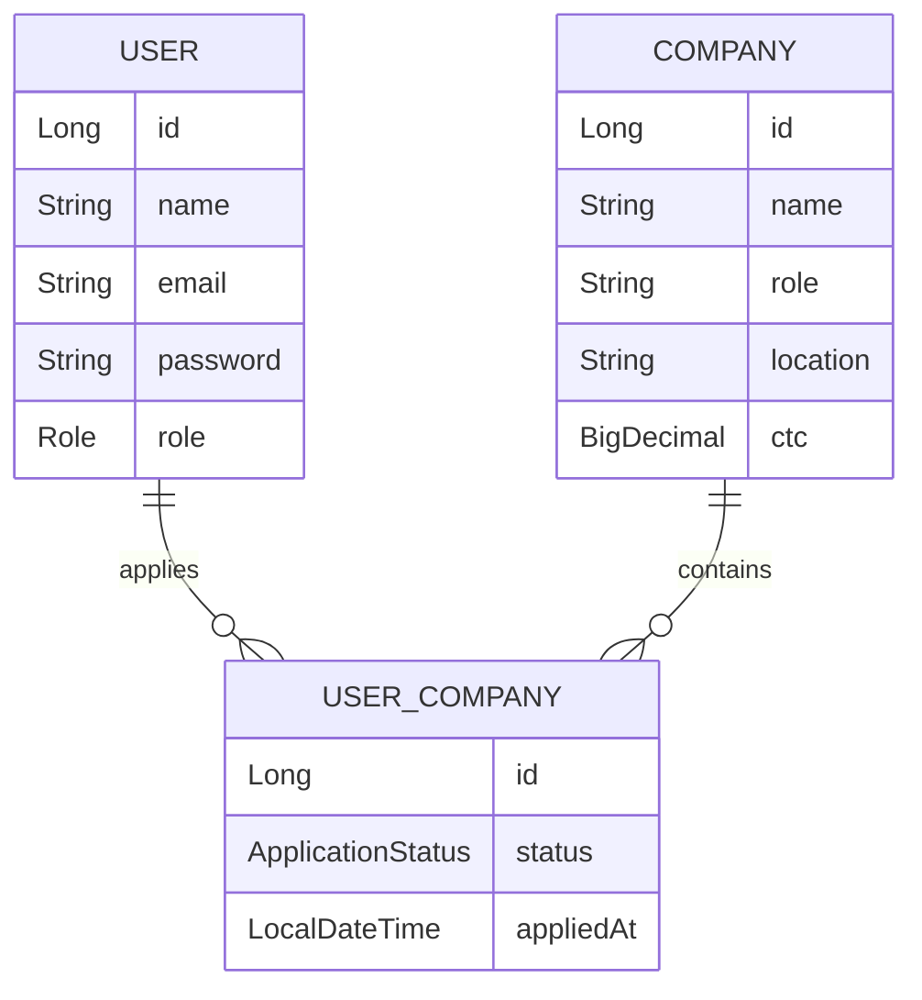
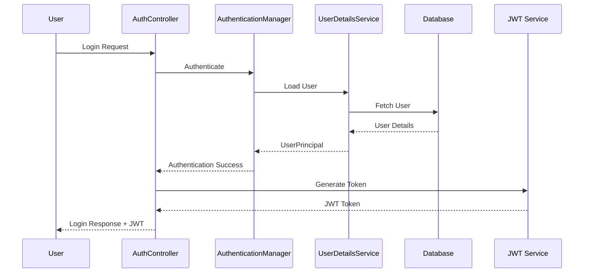

<p align="center">
  
</p>

# 🚀 Placement Tracker Backend


A production-inspired backend application built with **Java 17** and **Spring Boot** to help students manage their placement journey. The application allows users to track job applications, manage companies, visualize application statistics through a dashboard, and securely access APIs using JWT Authentication.

> **Status:** 🚧 Active Development  
> Current Version: **v1.0.0**

---

# ✨ Features

## 🔐 Authentication & Security
- User Registration & Login
- JWT Authentication
- Spring Security
- BCrypt Password Encryption
- Stateless Authentication
- Role-Based Authorization

## 🏢 Company Management
- Add Company
- Update Company
- Delete Company
- View Companies
- Company Details

## 📄 Application Tracking
- Apply to Companies
- Update Application Status
- Delete Applications
- View Individual Application
- View All Applications

## 📊 Dashboard
- Total Applications
- Application Statistics
- OA Statistics
- Interview Statistics
- Offer Count
- Rejected Applications
- Recent Applications

## 🔍 Search & Filtering
- Filter by Status
- Filter by Company Name
- Combined Filters

## 📄 Pagination & Sorting
- Pageable APIs
- Sorting by Applied Date
- Configurable Page Size

## 📚 API Documentation
- Swagger UI
- OpenAPI Documentation
- JWT Authorization Support

## ⚙️ Backend Architecture
- DTO Pattern
- Manual Mappers
- Service Layer
- Repository Layer
- Global Exception Handling
- Validation
- Clean Layered Architecture

---

# 🛠 Tech Stack

| Category | Technology |
|----------|------------|
| Language | Java 17 |
| Framework | Spring Boot 3 |
| Security | Spring Security + JWT |
| ORM | Spring Data JPA + Hibernate |
| Database | PostgreSQL |
| Build Tool | Maven |
| Documentation | Swagger / OpenAPI |
| Utilities | Lombok |

---

# 🏗 Architecture

```
                REST API

               Controller  
                   │
                   ▼
              Service Layer
                   │
                   ▼
             Repository Layer
                   │
                   ▼
               PostgreSQL
```

The project follows a clean layered architecture where:

- Controllers handle HTTP requests.
- Services contain business logic.
- Repositories interact with the database.
- DTOs are used for request and response objects.
- Mappers convert between entities and DTOs.

---

# 📂 Project Structure

```
src
└── main
    ├── controller
    ├── service
    │     ├── impl
    ├── repository
    ├── entity
    ├── dto
    │     ├── request
    │     └── response
    ├── mapper
    ├── security
    ├── exception
    ├── config
    └── util
```

## 🗄 Database ER Diagram



## 🔐 Authentication Flow



---

# 📌 API Modules

## Authentication

| Method | Endpoint | Description |
| --- | --- | --- |
| POST | `/api/auth/register` | Register a new user |
| POST | `/api/auth/login` | Login and receive a JWT |

## Companies

| Method | Endpoint | Description |
| --- | --- | --- |
| POST | `/api/companies` | Create a company |
| GET | `/api/companies` | Get all companies |
| GET | `/api/companies/{id}` | Get a company by ID |
| PUT | `/api/companies/{id}` | Update a company |
| DELETE | `/api/companies/{id}` | Delete a company |

## Applications

| Method | Endpoint | Description |
| --- | --- | --- |
| POST | `/api/applications` | Apply to a company |
| GET | `/api/applications` | Get logged-in user's applications |
| GET | `/api/applications/{id}` | Get an application by ID |
| PUT | `/api/applications/{id}` | Update an application |
| DELETE | `/api/applications/{id}` | Delete an application |

Supports

- Pagination
- Sorting
- Status Filtering
- Company Search

Example

```
GET /api/applications?page=0&size=10

GET /api/applications?status=APPLIED

GET /api/applications?company=Google

GET /api/applications?status=OA_SCHEDULED&company=Google
```

---

## Dashboard

| Method | Endpoint | Description |
| --- | --- | --- |
| GET | `/api/dashboard` | Get placement dashboard statistics |

Returns

- Total Applications
- Applied Count
- OA Count
- Interview Count
- Offers
- Rejections
- Recent Applications

---

# 🔒 Authentication

Protected endpoints require a JWT access token.

Example

```
Authorization: Bearer <your_jwt_token>
```

Swagger also supports JWT authorization using the **Authorize** button.

---

# 🗄 Database Design

```
                User
                 │
        ┌────────┴────────┐
        │                 │
        ▼                 ▼
 UserCompany         Company
```

---

# 🚀 Running the Project

## Clone Repository

```bash
git clone https://github.com/Vishesh-8090/Placement-Tracker.git
```

---

## Create PostgreSQL Database

```
placement_tracker
```

---

## Configure

Update the appropriate configuration file with your database credentials before running the application.

For example:

- `application.yml`
- `application-dev.yml` (if using the `dev` profile)

Ensure the following are configured:
- PostgreSQL URL
- Username
- Password
- JWT Secret

---

## Run

```bash
mvn spring-boot:run
```

or

Run the main Spring Boot application from IntelliJ IDEA.

---

# 📖 Swagger Documentation

After running the application

```
http://localhost:8080/swagger-ui/index.html
```

---

# 📈 Future Improvements

- Wishlist Module
- Email Notifications
- Scheduled Reminder Jobs
- Docker Support
- Unit Testing
- GitHub Actions CI/CD
- Resume Upload
- Analytics Module

---

# 🎯 Learning Objectives

This project was built to strengthen knowledge of:

- Spring Boot
- Spring Security
- JWT Authentication
- Spring Data JPA
- Hibernate
- PostgreSQL
- REST API Design
- Layered Architecture
- DTO Pattern
- Repository Pattern
- Exception Handling
- API Documentation

---

# 👨‍💻 Author

**Vishesh Raj**

- GitHub: https://github.com/Vishesh-8090
- LinkedIn: https://www.linkedin.com/in/vishesh-raj-434658282

---

## ⭐ If you like this project

Give the repository a ⭐ on GitHub!

---

## License

This project is suitable for learning, college submission, and portfolio use.